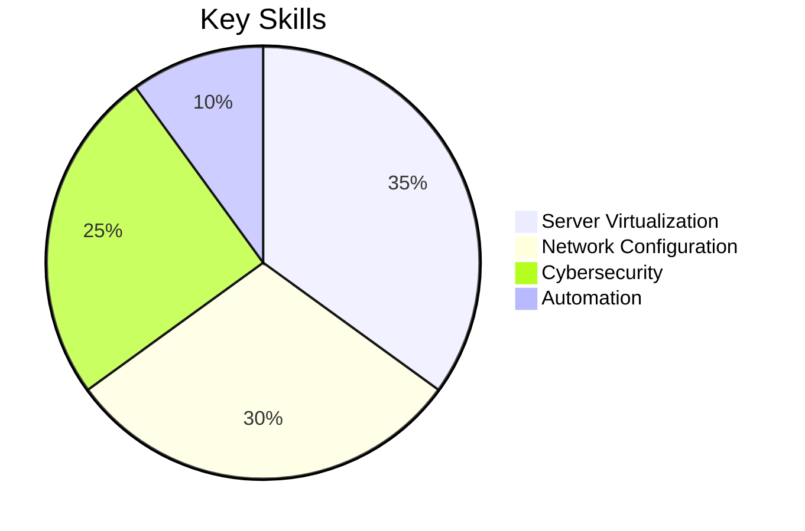

# Lucas Alger Day 💻

Welcome to my GitHub profile! I am a Software Development and Management Engineering student passionate about technology and continuous learning.

---

## 📚 Education

| **Institution/Certification**          | **Period**           | **Achievements**                                                              |
|----------------------------------------|----------------------|-------------------------------------------------------------------------------|
| **TSU in Software Development (UTCJ)** | 2021-01-07 - Present | 🏅 High academic performance 🔍 Self-taught with rapid adaptation to technologies |
| **CISCO IT Essentials**                | 2022-04-15 – 2022-08-25 | 🖥️ Hardware/software management 🔧 Advanced system maintenance               |
| **Cisco NDG Linux Essentials**         | 2022-01-07 – 2022-04-07 | 🐧 Mastery of Linux commands ⚙️ Operating system configuration              |
| **CISCO CCNAV7: Networks**             | 2022-08-25 – 2021-12-10 | 🌐 Network administration 🛠️ Enterprise infrastructure configuration        |

---

## 🚀 Technical Skills

### 🗃️ Databases

### 🛠️ Frameworks

### 📡 Backend

### 🎨 Frontend

### 🔌 Systems & Networks

---

## 📊 Technical Proficiency

| **Category**         | **Technologies**                                                              | **Level**        |
|----------------------|------------------------------------------------------------------------------|-----------------|
| **Databases**        | MongoDB, MySQL, SQL Server                                                  | ⭐⭐⭐⭐⚡ (85%) |
| **Backend**          | Python, JavaScript, C#, PHP                                                 | ⭐⭐⭐⭐ (80%)  |
| **Frontend**         | HTML/CSS, Angular, Ionic, React                                             | ⭐⭐⭐⚡ (75%)  |
| **Operating Systems** | Linux, Ubuntu, Windows                                                     | ⭐⭐⭐⭐⭐ (90%) |
| **Networking**       | Cisco CCNA, Switches, Router Configuration                                  | ⭐⭐⭐⭐⚡ (88%) |

---

## 🌐 Network Administration

